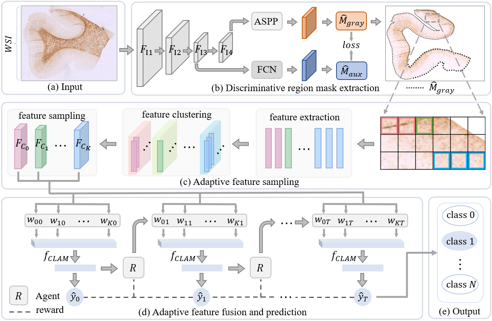

# Adaptive Regional Feature Fusion for Brain WSI Iron Concentration Grading in Neurodegenerative Research

This project addresses the classification of iron concentration levels in brain whole slide images (WSIs) to support neurodegenerative disease research. The approach utilizes adaptive regional feature fusion to accurately grade iron concentrations in brain tissue samples.

## Environment Setup

Before running the code, please install the required Python packages listed in the requirements.txt file. You can install all dependencies with the following command:
```
pip install -r requirements.txt
```
Make sure you are using a compatible Python environment to avoid version conflicts.

### Step 1: Mask Generation
The first step of the workflow is to generate mask files in JSON format. In this study, we employed a DeepLabV3-based segmentation model to create masks highlighting gray matter regions in brain WSIs. If you already have your own ROI annotations in JSON format (for example, for other specific regions), you can directly use them instead of generating new masks.

### Step 2: Feature Extraction
Run the Python scripts in the `process_tiff` directory to process the TIFF images.  Follow the steps below to sequentially perform patch generation, feature extraction, and feature clustering:
```
python make_patches.py
python extract_patch_feature.py
python patch_feature_cluster.py
```
After running these scripts, the following output files will be generated:
- NPZ files containing extracted features
- JSON files containing cluster indices information

### Step 3: Training and Testing
Execute the Python scripts in the `execute` directory to train the classification model and test its performance on the dataset.
